<!-- title: EBPE Questions Catalog -->

# 970314 Environmental Bioprocess Engineering

_Lukas Schönmann_\
_April 2023_

**Exam questions catalog**  
(Duration of examination: 1 hour)

## Principles and Applications of Anaerobic Digestion \[Drosg\]

1. **Sketch simple lab test equipment to measure the biochemical methane potential.**\
   Continuous or batch tests possible.

   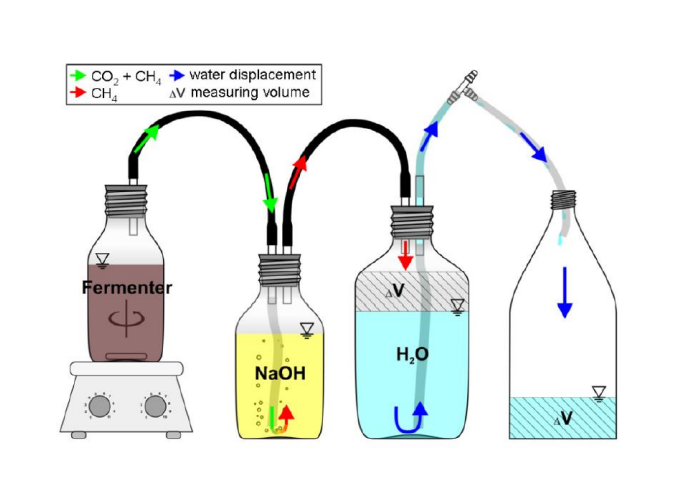

2. **In which sectors can biogas technology be applied and what different biogas substrate types do you know?**
   - Sectors: Renewable energy, biogas as a fuel - agriculture, industry, landfill, sewage, transport
   - Crop silage (maize, grass, rye, ...), energy crops (sunflower), organic waste from household and industry (whey, slaughterhouse), manure, sewage sludge, garden & park cuttings
3. **Sketch a scheme of a biogas plant (agricultural or waste treatment) including peripheral components.**\
   Biogas plant located in Strem (grass silage, corn silage):

   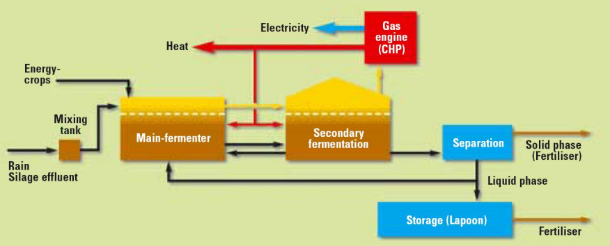

4. **What kind of benefits can biogas offer (to a company or society)?**
   - Renewable energy from waste with a high, not yet fully used potential
   - Biofuel with large GHG reduction
   - Improved manure treatment: high quality fertilizer, environmental protection
   - Farmers/industry: waste removal with local energy gain (electricity, heat)
5. **Describe the main differences of anaerobic compared to aerobic wastewater treatment with regard to the carbon balance.**
   - Aerobic: ~50 % excess sludge, ~50 % CO2, ~1 % effluent
   - Anaerobic: ~1-5 % excess sludge, ~90 % biogas (~70 % CH4, ~30 % CO2), ~5-10 % effluent\
     Methanogenesis is anaerobic, formed from acetic acid.
6. **Describe the 4-step model of the anaerobic digestion process.**
   - Hydrolysis: breaking down complex organic compounds to simple ones (carbohydrates, proteins, fats to sugars, amino acids, fatty acids)
   - Acidification: conversion of simple organic components to organic acids and alcohols, CO2, NH4 and H2
   - Acetogenesis: Conversion of organic acids to acetic acid, CO2 and H2
   - Methanogenesis: Conversion of acetic acid to methane and CO2
7. **What substances are known to inhibit anaerobic digestion, distinguish between metabolic compounds and compounds originally present in the feedstocks.**
   - Oxygen
   - Substrate: ammonium, soluble heavy metals, disinfectants/antibiotics, halogenated compounds
   - Metabolic products: ammonium, volatile fatty acids, sulfides
8. **Describe the energy demand in biogas plants, which process steps demand energy?**
   - Heating of the fermenters (optimum T)
   - Feedstock pre-treatment (separation/crushing)
   - Feedstock transportation/pumping
   - Mixing of the fermenter (prevent layer formation, release gases)
   - Digestate dewatering
   - Digestate utilization
   - Processing of the biogas (desulfurication, CO2 removal)
9. **Describe briefly the different utilisation options for biogas.**
   - Electricity production: combined head and power (CHP) gas engine ($\eta_{el}$ ~40 %, heat by cooling water and exhaust gas)
   - Heat supply: cooking, district heating and process heat by integration ($\eta_{therm}$ ~80-90 %)
   - Natural gas substitution: upgrading to bio-methane and feeding into the natural gas grid (> 95 % methane, no water, CO2, hydrogen sulfide, ammonia)
   - Biofuel: direct use or indirectly through gas grid (large GHG reduction)
10. **Name and sketch 1 reactor type (only reactor not including peripheral equipment) which is suitable for anaerobic wastewater treatment**\
    Membrane reactor:

    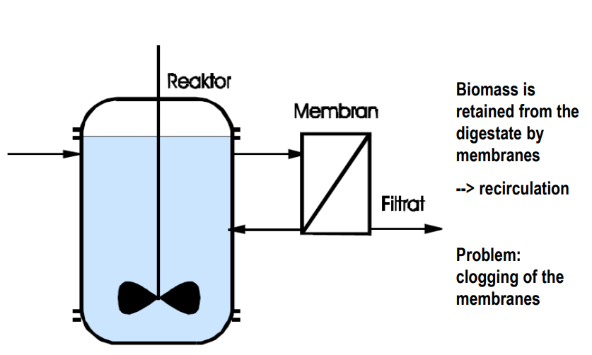

11. **Name and sketch 1 reactor type (only reactor not including peripheral equipment) which is suitable for the treatment of solid feedstocks (e.g. waste)**\
    Plug flow reactor: waste flows in, displaces digester volume, equal amount flows out. Minimal mixing, waste flows as plug. Around 15-20 days retention time. Should be cleaned routinely to prevent sediment from building up.

    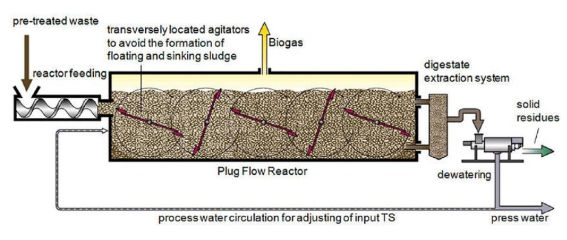

12. **List the different control parameters for the assessment of the process condition (not early detection of process disturbances)**
    - Substrate quantity and composition
    - Gas production and composition
    - Fermentation temperature
    - Dry matter/total solids content (+viscosity) of the fermentation mixture
    - pH value
    - Ammonium nitrogen
13. **List different control parameters for early detection of process disturbances**
    - FOS/TAC-ratio (free organic acids, total inorganic carbon)
    - Redox potential
    - Organic acids (volatile fatty acids)
    - Hydrogen in gas and liquid phase
    - Non-specific measurements (NIRS - Near Infra Red Spectroscopy)
14. **Name 4 different ways how to estimate the methane yield of a specific feedstock/waste**
    - From tables/literature
    - Experiments (empirical)
    - Theoretical calculation via COD (chemical oxygen demand - organic compounds; mass balance from $\textrm{COD}_{\textrm{in}} = \textrm{COD}_{\textrm{out}}$ with substrate and methane)
    - Buswell equation with elementary formulae depending on feedstock composition

## Aerobic Wastewater Treatment \[Neureiter\]

15. **What are the major sum parameters for the characterization of sewage and waste water? What do they measure and what are typical values?**
    - COD - Chemical Oxygen Demand: measure of pollution with _oxidizable_ compounds [mg O2/L]; can be determined using $\textrm{K}_2\textrm{Cr}_2\textrm{O}_7$ as oxidant. Household sewage ~600 mg/L.
    - BOD - Biochemical Oxygen Demand: measure of pollution with _biodegradable_ compounds [mg O2/L]; usually incubation for 5 days ($\textrm{BOD}_5$) and DO (dissolved oxygen) consumed by aerobic bacteria. Household sewage ~300 mg/L.
    - TOC - Total Organic Carbon: contamination of total amount of carbon in organic compounds (total carbon content) [mg/L]
    - PE - Population Equivalent: parameter for the design of WWTPs (waste water treatment plants); defined as 60 g $\textrm{BOD}_5$ and ~130 L of waste water per day
16. **How can you measure the BOD? What do you have to consider if you have persistent substances?**\
    Dilution method: dilute sample with water containing nutrients and oxygen. Measure DO before and after incubation at $20\degree \textrm{C for 5 days (BOD}_5)$, for instance with a Clark electrode. Alternatively, measure pressure drop from consumption of oxygen.\
    Persistent substances can be toxic and inhibit the microorganisms. This can reduce the consumed oxygen measured.
17. **Sketch the process diagram of an aerobic sewage treatment plant.**

    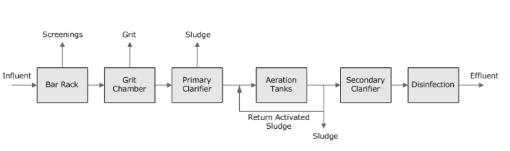

18. **Which chemolithotrophic microorganisms are of importance in biological wastewater treatment?**\
    (CO2 fixation to acquire carbon, power source are oxidizable inorganic compounds; only at low sludge loads and requires high DO.)\
    _Nitrosomonas_ ($\textrm{NO}_2^-$ from $\textrm{NH}_4^+$) and _Nitrobacter_ ($\textrm{NO}_3^-$ from $\textrm{NO}_2^-$): Nitrification - conversion of $\textrm{NH}^4$ to $\textrm{NO}_2^-$ and further into $\textrm{NO}_3^-$.
19. **What is the significance of protozoa in biological wastewater treatment?**\
    10-20 % by volume of organisms in activated sludge.

    - Elimination of particulate waste water constituents
    - Elimination of dissolved and colloidal dissolved wastewater constituents
    - Elimination of bacteria and viruses
      - increased selection pressure and reduce pathogens
      - reducing excess sludge production
    - Production of mucilaginous substances

20. **What is the difference between concentration and load? Why is it important to consider the load?**\
    Concentration $c_s\enspace [\textrm{kg m}^{-3}]$ can be reduced by dilution. However: Pollution cannot be solved by dilution! This is because the Volatile Suspended Solids (VSS) load $\dot m \enspace [\textrm{kg h}^{-1}]$ stays the same!
    $$\dot m = c_s \cdot \dot V_{Fluid}$$

## Valorisation of organic wastes \[Neureiter\]

21. **Explain the major differences between composting and anaerobic digestion of wastes? Which kind of wastes are more suitable for composting?**
    |Characteristics | Composting | AD|
    | -- | --- | --- |
    |Suitable wastes | Structure-rich wastes with water content <70 % | non-structured, non-woody wastes with high water content|
    |Obtainable reduction of the organic fraction|40-50 %| up to 70 %|
    |Organic load of waste water|up to 50,000| up to 5,000|
    |Odor emissions|5,000-10,000 OU/s| 300-400 OU/s|
    |Required energy|20-60 kWh/t waste|100-200 kWh/t|
    |Produced energy|-|400-800 kWh/t of waste (biogas)|
    |Final product, quantity|Compost, ~30 % w/w| Digestate, 20-35 % w/w|
    |Costs|92-175 €/t waste|70-140 €/t waste (incl. revenue but w/o post-treatment)|
22. **Sketch and explain the time course of a composting process. Name the different stages.**

    - Pre-rotting (wk 1-2): mesophilic, acidification, yeasts and fungi
    - Intensive rotting (wk 3-4): thermophilic, alcalization, bacteria and actinomycetes
    - Post-rotting (wk 7-16): mesophilic, recolonization with fungi
    - Ripening/Maturing

      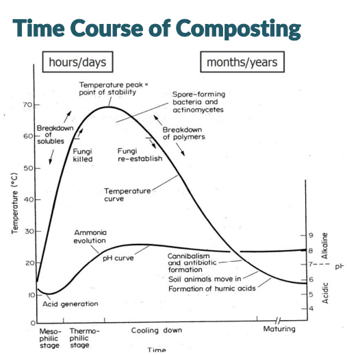

23. **Name two types of composting systems and explain how they work.**

    - **Drum composting**: ventilated rotating drums filled with compost. Suitable for pre-rotting, smaller plants with high mechanical wear on equipment.

      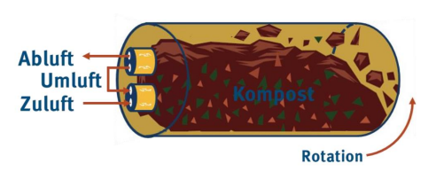

    - **Windrow composting**: long rows of biodegradable matter which are regularly turned to mix moisture and temperature; open or enclosed (in a hall), passive or active aeration via tubes or regular moving.

      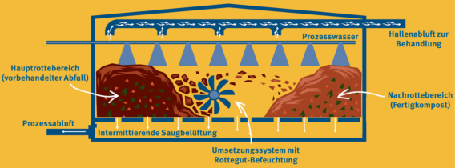

24. **Sketch a general technical procedure for bio- and green waste composting.**

    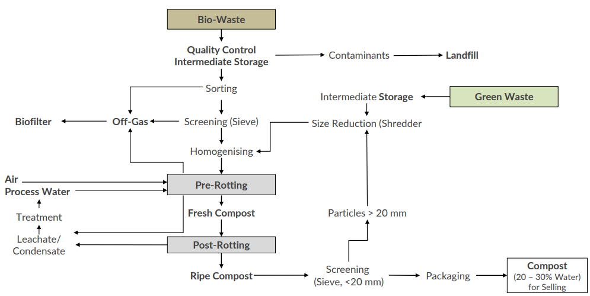

25. **What is the mass balance of the composting of bio-waste? Explain the different mass streams and consequences.**

    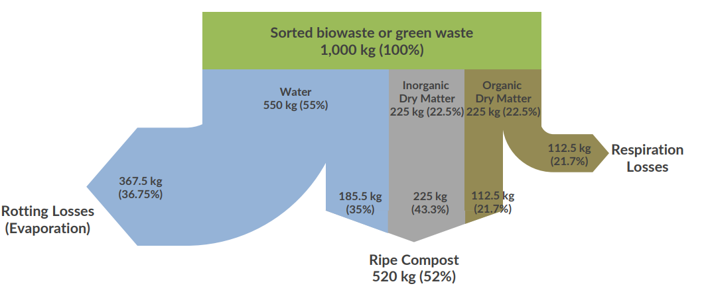

    - Concentration of inorganic compounds increases
    - Heavy metal contamination could become problematic
    - Efficient pre-sorting of input material and quality control is essential

26. **A composting plant is reported by local authorities for odor problems. What measures could be taken to minimize odor emissions?**

    **Primary measures:**

    - Air/water management
    - Avoid overloading of the process
    - Structure of the compost material
    - Enclosure, apply negative pressure

    **Secondary measures:**

    - Thermal oxidation (catalytic combustion)
    - Adsorption (activated carbon)
    - Condensation
    - Ozonation/Scrubbing
    - Biofilter

27. **What is mechanical-biological waste treatment (MBT)? For what types of waste is it applied? What are the advantages?**\
    Combines mechanical sorting with biological treatment (composting or AD).\
    Designed for mixed household waste and commercial and industrial wastes. Advantages:

    - Reduction of matter going to landfill
    - Extracting recyclable materials
    - Stabilization into compost-like output
    - Production of biogas and refuse derived fuel (RDF)

    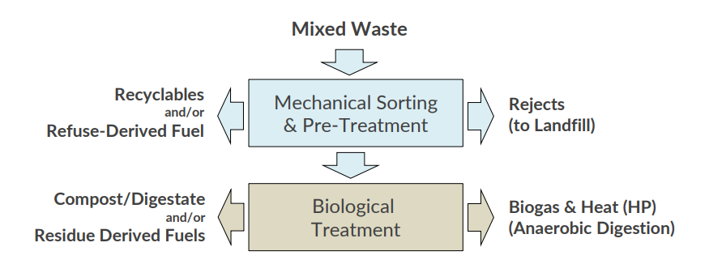

28. **Sketch the process scheme of a mechanical-biological waste treatment plant.**

    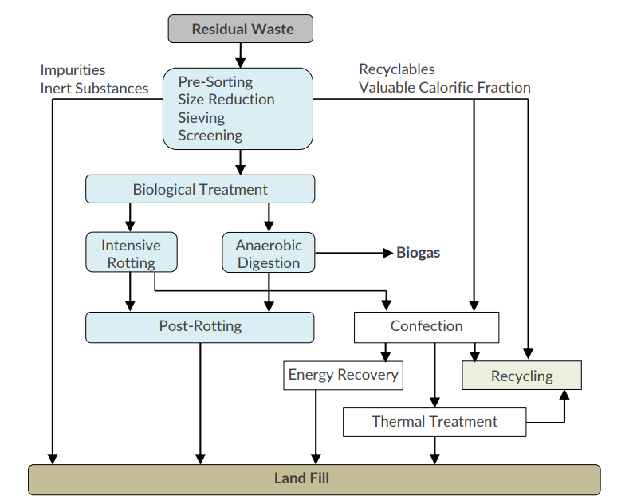

## Biological soil remediation \[Loibner\]

29. **Describe the function of the ALSAG. Which other law is an important basis for imposing remedial measures? Give a brief description.**\
    Twofold: registration, evaluation and assessment of historically contaminated sites (in the Verdachtsflächenkataster as suspected site & Altlastenatlas after risk assessment or rehabilitation); and\
    regulation of financing of remediation - classification of priority.

    The **AWG** - **Abfallwirtschaftsgesetz** - regulates the implementation of remediation and management of historical deposits.\
    Additionally, the **WRG** - **Wasserrechtsgesetz** - is the most important legal basis to prompt remediation for historical contaminated sites.

30. **What sites are listed in the registry for contaminated sites and in the registry for sites with suspected pollution? At what circumstances will sites enter this registries?**
    - Registry for sites with suspected pollution (Verdachtsflächenkataster): historical sites and deposits, that **based on their previous use** may pose a considerable hazard for human health and the environment.
    - Registry for contaminated sites (Altlastenatlas): historical sites and deposits, that after **investigations and risk assessment** pose a considerable hazard for human health and the environment.
31. **What sampling strategies are you aware of? For which fields of application / questions are the individual strategies used?**\
    In practice, combinations are used:
    - Judgmental sampling: relying on expertship instead of statistics - useful to identify hazard source
    - Random sampling: useful to verify cleanup, but not if site is heterogeneous
    - Stratified random sampling: subdivisions with random samples - useful to evaluate treatment options by gaining information on chemical properties of each stratum
    - Search sampling: number of samples and grid size based on acceptable level of error - useful to identify hot spots
    - Systematic sampling: regular subdivision patterns, sampling at nodes - useful to identify extent of contamination and confirm cleanup
    - Transect sampling: transect lines with samples at regular intervals - useful to identify extent of contamination and confirm cleanup
32. **What treatment steps are required in order to obtain an analysis result from a contaminated soil sample?**\
    First, it makes sense to do a historical data review. If not available, analytical screening or even further an off-site lab (full chemical) analysis are required.

    ```mermaid
    graph TD;
      Sampling-->Compositing;
      Compositing-->Homogenisation;
      Homogenisation-->id4(Subsampling\ngrinding to reduce particle size and error);
      id4-->id5(Shipping\nglass containers with teflon-lined lids);
      id5-->id6(Storing\nat 4 degree C in the dark, 7d to 1m for most analytes);
      id6-->id7(Analysis);
    ```

33. **Name the potential sources of error for the analysis of contaminated soil. Rank them according to the size of error.**\
    From high to low degree of error:
    - Sampling
      - Design: biased or distance between sampling points too large
      - Methodology: cross-contamination
      - Sample heterogeneity
    - Extraction technique: inefficient extraction, inappropriate solvent
    - Analytical procedures: cross contamination, inappropriate methodology
34. **Which components / substance classes are grouped within the term petroleum hydrocarbons?**

    - Unbranched _n_-alkanes (paraffins)
    - Branched _iso_-alkanes (iso-paraffins)
    - Cyclic alkanes (Naphthenes)
    - mono-aromatic compounds (BTEX)
    - Alkylated compounds
    - PAHs - polycyclic aromatic hydrocarbons
    - Heterocyclic compounds

35. **Which method is used for the analytical determination of petroleum hydrocarbons in soil? Provide a brief description of the measuring principle.**
    Gas chromatography coupled with flame ionization detector: substances have different boiling points in the range of 174 °C to 525 °C. They are vaporized in a mobile phase (inert gas) and pass through a stationary phase (column). Detection via FID: combustion in a hydrogen flame; ions are proportional to concentration.

    PAHs can be determined via HPLC coupled with fluorescence detector.

36. **What is soil made of? Soil components in general?**\
    Soil consists of minerals and organic matter (humic matter) in 3d arrangement (soil microstructure). Pores are filled with soil gas and soil solution.
    - **Inorganic constituents:** mineral matter (silicates, clay, oxides and hydroxides, carbonates, sulfates, sulfides, phosphates)
    - **Organic constituents:** "dead" organic matter, dead biomass and degradation products, and live organic matter (_edaphon_ - all organisms living within soil)
37. **What is soil texture, sub-classes?**\
    Classification of soil based on the physical texture. By particle size distribution, different types can be established: **clay, silt, sand and loam**.\
    The twelve classifications are based on the percentages of these in the soil with possible combinations. A texture triangle can help with the classification. E.g., sand, loamy sand, sandy loam, sandy clay loam, ... and so on.
38. **Influence of soil organic matter (humus) on the behaviour of soil pollutants?**\
    Highly heterogeneous - flexible regions and condensed regions made up of aromatic structures $\rightarrow$ s.c. "black carbon", sheet structure of aromatics which very strongly binds PAHs.
39. **Importance of bioavailability of organic pollutants in soil, description of factors influencing the bioavailability?**\
    Two consequences: **bioaccessibility** (remediation) and **chemical activity** (toxicity). Dependent on:

    - **Pollutant characteristics** (polarity, structure, concentration)
    - **Soil characteristics** (organic matter, 3d-structure, minerals)
    - Co-pollutants (sorption sites, solubilisation)
    - Environmental factors (pH, temperature, salinity)
    - Retention time in soil (biotic/abiotic ageing)
    - Receptor-organism (uptake, metabolism)

    Sequestration of PAHs in soil: sorption (distribution between fluid and solid phase, absorption/adsorption), diffusion, encapsulation.

40. **Explain the meaning of Kd and Koc in terms of their importance for the sorption of organic pollutants in soil?**\
    Solid-water distribution coefficient:

    $$\textrm{K}_\textrm{d} = \textrm{C}_\textrm{S}/\textrm{C}_\textrm{W}$$

    Organic carbon normalized solid-water distribution coefficient:

    $$\textrm{K}_\textrm{OC} = \textrm{K}_\textrm{d}/\textrm{f}_\textrm{OC} = \textrm{C}_\textrm{OC}/\textrm{C}_\textrm{W}$$

    Chemicals associate with solid phase. This is important for bio-availability of soil contaminants. Organic matter (OM) binds pollutants - hydrophobic organic contaminants (HOC). Higher quality OM has stronger sorption strength. Hydrophobicity, reactivity and structure all impact sorption.

    - Adsorption: molecules adhere to 2-dimensional surfaces
    - Absorption: molecules penetrate 3-dimensional matrices

41. **Provide a general description of the microbial degradation of organic pollutants at aerobic conditions?**\
    Energy produced by transferring electrons from substrate to oxygen. Contaminants (PHCs, PAHs) oxidized to $\textrm{CO}_2$ while oxygen is reduced to water. Respiration is fast & efficient. Solubility of oxygen in water can be limiting.

    $$\textrm{Organic pollutant + O}_2 \rightleftharpoons \textrm{CO}_2 + \textrm{H}_2\textrm{O}$$

42. **Provide a general description of the microbial degradation of organic pollutants at anaerobic conditions? Which electron acceptors are used?**\
    If no molecular oxygen is available. Electron acceptors different from oxygen (with increased solubility in water, e.g. nitrate, sulfate). Degradation is usually slower than by respiration and sometimes incomplete. Halogenated hydrocarbons can also act as acceptors, and contaminants (PHCs, PAHs) are oxidized.
43. **What are the prerequisites for microbial growth with regard to biological soil remediation?**
    - Biodegradability of pollutants, depended on:
      - Chemical structure
      - Concentration
    - Bioavailability of pollutants, dependent on:
      - Soil characteristics (organic matter)
      - Age of contamination
    - Inhibiting conditions to be avoided:
      - Metals in high concentrations
      - Osmotic stress
      - Environmental conditions (see `question 44` below)
44. **Under which environmental conditions can microorganisms degrade pollutants in soil and groundwater bodies?**
    - Mineral nutrients ratios
      - aerobic: C:N:P:K=100:10:1:1
      - anaerobic: C:N:P:K=150-300:5:1:1
    - Environmental conditions
      - 50-90 % max. water holding capacity (aerobic) or water saturation (anaerobic)
      - pH 4-9
      - T > 10 °C
    - Electron acceptor (oxidative degradation)
      - molecular oxygen
      - alternative electron acceptors (anaerobic)
    - Electron donator (reductive degradation)
      - hydrogen
      - acetate
45. **What preliminary investigations (analysis) allow a conclusion on the biodegradation potential of organic contaminants in soils? Why?**

    - Standard analysis:
      - Determination of pollutant content (preferably using standards like PAHs)
      - Determination of nutrient content (N, P, (K))
      - Determination of water content
      - Determination of pH in soil suspension
      - Description of texture and estimation of max. water holding capacity
    - Additional measurements:
      - Total organic carbon (TOC)
      - Microbial activity (e.g. soil respiration)
      - Bioavailability

    $\rightarrow$ because microorganisms can degrade pollutants only under certain environmental conditions and prerequisites

46. **When is it recommended to accomplish preliminary experiments prior to taking bioremediation measures of contaminated soil?**\
    Required when preliminary investigations do not reveal clear information on the biodegradability of pollutants in soil and as a consequence the success of a bioremediation treatment is not ascertained. This may happen if:
    - The characteristics of the input material are not optimal (e.g. moisture, texture)
    - The microbiological degradability of the contaminant is insufficiently documented for field applications
    - The biodegradation could be impaired by the presence of toxic substances
47. **What (preliminary) laboratory tests are used to assess the biological treatability of contaminated soils? Give a brief description.**\
    In general: smaller scale leads to overestimating the degradation rates, however concentrations can be assessed within a shorter period of time.
    - Soil slurries: approx. 10 g soil are suspended in a nutrient solution under optimal conditions, testing different treatment options. Short duration (~3 weeks).
    - Soil columns: 10-100 kg soil are packed in a column, saturated and non-saturated. Water flow/permeation is simulated (like _in situ_). Long duration (> 3 months).
48. **Principal differences between containment and decontamination techniques. Give some examples for respective techniques.**
    - **Containment technologies** - pollutants remain at site, cutting of pathways for spreading:
      - Separation of contaminated zone from groundwater body
      - Containment/encapsulation
      - Stabilization or solidification, e.g. addition of lime, cement or clay
      - Translocation to landfills
    - **Decontamination technologies** - removal of pollutants from site (physical, chemical and/or biological):
      - Thermic treatment
      - Soil vapor extraction
      - Soil washing
      - Electro-kinetic techniques
      - Chemical oxidation
      - **Microbial techniques**
49. **Describe the biopile technique. Specify the scope, give advantages and disadvantages.**\
    Contaminated soil is mixed with amendments (coarse materials) to increase permeability and placed in windrows. Compost is added as inoculant. Oxygen is supplied by aeration using a blower or semicontinuous mixing. Short duration of 1-6 months.
50. **Ex situ versus in situ techniques: principle, advantages and disadvantages. Give criteria for selecting in situ or ex situ application.**
    - _Ex situ_:
      - (-) Excavation of contaminated soil required
      - (+) On site or off site treatment
      - (+) Supply of additives is possible
      - (+) Facile (easy) microbial inoculation
      - (+) Homogenization of contaminated soil by simple mixing
    - _In situ_:
      - (+) No excavation of contaminated soil: subsurface acts as bioreactor
      - (-) Subsurface needs to be permeable ($k_f$ value)
      - (-) More comprehensive site characterization required
      - (-) Supply of additives is a complex task (distribution/concentration: point addition)
      - (-) Control of _in situ_ processes can be tricky\
        $\rightarrow$ Intensive monitoring programme
      - Application: large sites, built sites, soil and groundwater are contaminated
51. **Which parameter is used to describe the water conductivity of soil? What does it depend on?**\
    By the hydraulic conductivity or permeability coefficient - $k_f$ value [m/s].\
    The water flow in the saturated zone depends on the characteristics of the percolated matter. To mathematically describe the flow in the subsurface, the soil permeability is required.

    - Gravel: $k_f = 10^{-1} - 10^{-2}\enspace\textrm{m/s}$
    - Clay: $k_f = 10^{-9}\enspace\textrm{m/s} \rightarrow$ practically impermeable
    - Frequently in subsurface: $k_f = 10^{-2} - 10^{-4}\enspace\textrm{m/s}$

    $$k_f = K\cdot\rho\cdot g/\eta \\ K \dots \textrm{permeability} \\ \rho \dots \textrm{density} \\ g \dots \textrm{gravity} \\ \eta \dots \textrm{dynamic viscosity}$$

    The $k_f$ value depends on the viscosity of the fluid.

52. **What is the minimum permeability for the application of in situ remediation techniques? Provide corresponding kf values and the associated rock / soil type.**\
    Minimum is $k_f = 10^{-4}\enspace\textrm{m/s}$.
    - Gravel: $k_f = 10^{-1} - 10^{-2}\enspace\textrm{m/s}$
    - Sand, gravelly: $k_f = \enspace \approx10^{-3}\enspace\textrm{m/s}$
    - Medium sand: $k_f = 10^{-3} - 10^{-4}\enspace\textrm{m/s}$
    - Fine sand: $k_f = 10^{-4} - 10^{-5}\enspace\textrm{m/s}$
53. **Describe concept and operation of a pump & treat system. Advantages and disadvantages?**\
    _In situ_. Common method for cleaning up groundwater contaminated with dissolved chemicals. Groundwater is pumped form wells to an above-ground treatment system that removes the contaminants, using e.g. activated carbon, a bioreactor, or a combination thereof. Pumping creates a suction around extraction wells so that contaminated water moves from the plume towards them and is kept from drinking water or other natural resources (containment). Clean water can be released at another place.

    Disadvantages: high energy input and duration of several years (hence nowadays considered only as containment technique and not for remediation).

    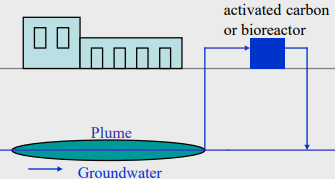

54. **Describe concept and function of a funnel & gate system. What is the preferred area of application?**\
    _In situ_. Passive groundwater treatment collection/treatment system. Cutoff walls (funnel) are used to guide groundwater towards a high flow barrier (gate) - a permeable reactive barrier (using activated carbon, zero valent iron, or adsorbents/absorbents). Must be designed to capture the whole contaminated groundwater plume. Area of application: large, complex sites where common techniques would be technically unfeasible/too expensive. Remediation can happen over decades with minimal maintenance.

    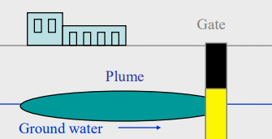

    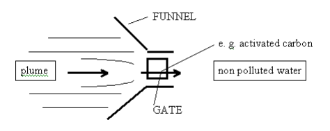

55. **Describe concept and operation of a biosparging system. Which contaminated soil zone can be remediation using this technique?**\
    _In situ_. Consists of injecting pressurized air into a contaminated zone in order to stimulate _in situ_ aerobic biological activity and dissolve any residual contamination.

    Gas is injected through a well below the plume and groundwater table along with nutrients, rising upwards. Possible with zones around the groundwater table - phreatic and vadose zone (saturated and unsaturated zones).

    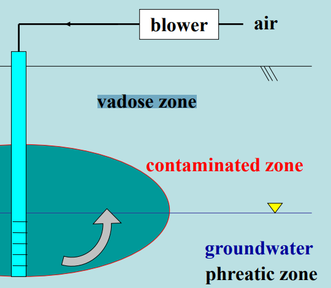

56. **Describe concept and operation of a ground water circulation well, give the area of application.**\
    _In situ_. Pump & treat method too slow for remediation (several decades). Compressed air injected into phreatic (saturated) zone to improve microbial metabolism. At the same time, groundwater is drawn from the aquifer through the well. A 3-dimensional circulation pattern of the groundwater is established which helps distribute the oxygen and contaminants.

    The combined process of biological treatment and physical extraction reduces the time required to achieve remediation goals.

    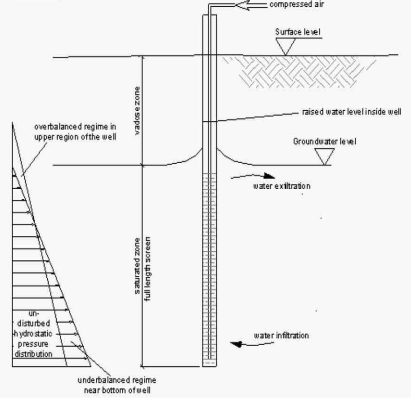

57. **Bioventing: operation, advantages and disadvantages?**\
    _In situ_. Biodegradation of NON-volatile contaminants (heating fuel, Diesel, ...) in vadose (unsaturated) zone. It enhances the activity of bacteria and archaea there by inducing air flow into the zone and, if necessary, addition of nutrients. It stimulates the natural _in situ_ biodegradation of contaminants. Oxygen is delivered by an electric blower or a passive air exchange system into the vent well.

    High soil moisture or low permeability reduce bioventing performance (fluctuating water tables, saturated soils). Vapors can build up in basements around the site.

    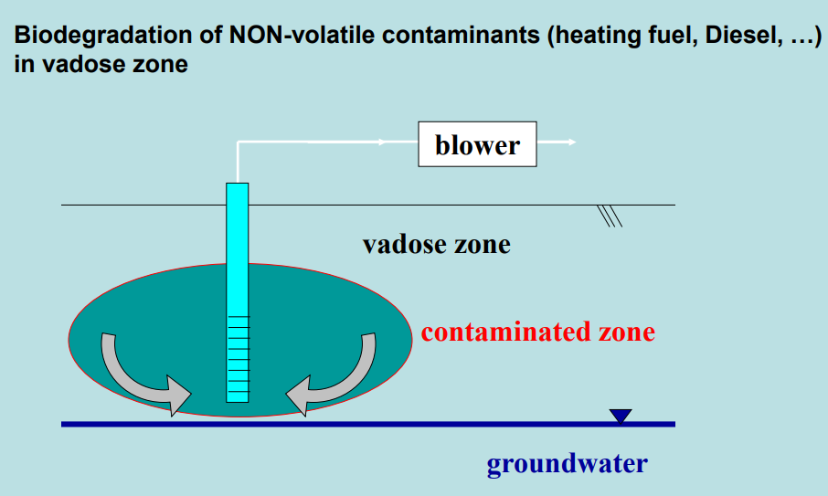

58. **Bioventing: What tests can be applied to estimate the remediation performance in advance?**\
    Testing the ROI - radius of influence. _In situ_ coverage of individual aeration wells over an area. Assessment e.g. by measuring pressure changes during venting test. The radius is defined as to which oxygen can be supplied to sustain maximal biodegradation. Should be measured at peak microbial activity as it reduces the radius. Dependent on soil properties. Test is to ensure that the entire site receives supply of oxygen-rich air to sustain biodegradation.

59. **Describe the difference between soil vapour extraction and bioventing. Specify the preferred areas of application.**\
    Bioventing uses only low airflow rates to provide just enough oxygen to sustain microbial activity. Soil vapor extraction, on the other hand, leads to withdrawal of volatile contaminants (gasoline, chlorinated hydrocarbons CHC) from the vadose (unsaturated) zone. Bioventing leads to biodegradation of NON-volatile contaminants (heating fuel, Diesel, ...) by only adding air. With soil vapor extraction, the offgas must undergo treatment.
60. **Natural attenuation: concept, which processes are involved?**\
    "Doing nothing" - letting naturally occurring processes in soil do the remediation. Also enhanced natural attenuation (ENA) and/or monitored natural attenuation (MNA). The duration is decades. Involved processes:
    - Destructive mechanisms:
      - Biological degradation
    - Non-destructive mechanisms:
      - Dispersion, dilution (?)
      - Sorption, immobilization
      - Chemical and biological stabilization
      - Volatilization (?)
61. **Calculation**\
    **You will have to complete 2 calculations that may address the following topics: (i) remediation period based on in-situ or laboratory tests and (ii) quantification of contaminant removal based on in-situ respiration rates or off-gas measurements.**

    Calculation steps below are incomplete; make sure to check out the Excel file provided by the lecturer on BokuLearn!

    **Calculation of time needed for site clean-up**:

    - Calculate oxygen consumption rate \[%/d\] using linear regression of linear part of curve at start (make graph - O2 contaminated % against the time)
    - Calculate biodegradation rate \[mg/kg d\] based on oxygen consumption rate from in situ respiration data using the equation below
    - Use result to calculate remediation period in years

    $$k_b=\frac{-k_{O2} \cdot Vol_a \cdot d_{O2} \cdot C \cdot 0.01}{d_k}$$

    $$k_b \dots \textrm{biodegradation rate} (mg/kg*d)\\ k_{O2} \dots \textrm{oxygen consumption rate} (\%/d)\\ Vol_a \dots \textrm{gas filled pore space} (m^3 gas/m^3 soil)\\ d_{O2} \dots \textrm{density of oxygen} (mg/L)\\ C \dots \textrm{mass ratio hydrocarbon/oxygen for degradation} (1/3.5)\\ d_k \dots \textrm{soil bulk density} (g/cm^3)$$

    Calculate biodegradation rate constant from half life using exponential function (one phase decay):

    $$\textrm{Y}=\textrm{Y}_0 \cdot \exp(-K \cdot \textrm{X}) + \textrm{Plateau}$$
